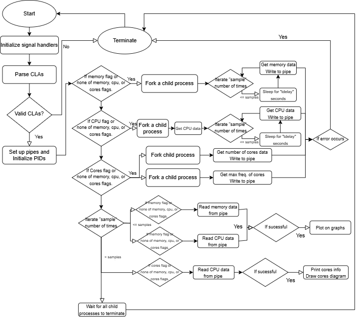

# Concurrent System Monitoring Tool

1.  ### Metadata
    - Author: Kobe Chui
    - Date Created: April 5, 2025

2.  ### Introduction

    This projecct attempts to redesign the system monitoring tool and implement concurrency and signal handling features. The system monitoring tool provides informaiton over specific period of time for certain sampling size including memory usuage, CPU utilization, number of cores in the CPU, and the maximum frequency among given cores.

4.  ### How I solved the problem
    -   I utilized my understanding in concurrency between processes and communication between processes, as well as signals handling for this project.
    -   I utilized a CLA parsing algorithm with custom flags and initialized variables within a flag structure.
    -   Since this project involve processing and communication between parent and child processes, I chose myMonitoringTool.c as the parent process and the main() function inside is the driver to instruct what information is needed for retrieval from the child process.
    -   For the child processes, I created process.c which is responsible for creating child processes, handling errors raised by child processes, etc. 
    -   For information collection, I created modules inclduing memory.c, cpu.c, core.c to distribute responsibilities evenly. I also created graph.c to handle graphing onto the terminal and utilities.c for miscellaneous functions that calculate offsets needed to graph. 
    -   For signal handling, signal_handler.c is responsible for responding to signal input from users, blocking SIGTSTP and SIGINT using 
    sigaction(). Global variable pause_requested was used to change signals between modules.
    
5.  ### Implementation

    My code is divided into 4 parts: the driver program - myMonitoringTool.c with process.c handling child processes; data retrieval programs - memory.c, cpu.c, and core.c; graphing program - graph.c along with miscellanenous functions in utilities.c; signal handling program - signal_handler.c; Lastly CLA parser - parse_command_line.c
    Header files are used to connect them, including process.h, memory.h, cpu.h, core.h, graph.h, utilities.h, signal_handler.h, and parse_command_line.h respectively.
    
    myMonitoringTool.c first uses the function setup_signal_handler from signal_handler.h to set up handlers to block SIGINT and SIGTSTP signal inputs in the terminal. Then, it uses functions from parse_command_line.h to parse CLAs and store flags indicated by the user. After that, child processes and pipes were created according to the indicated flags using functions in process.h, and system information is extracted through functions in memory.h, cpu.h and core.h. Lastly, any information successfully read from the pipes are printed onto the terminal in a graphing format using graph.h. 

    parse_command_line.h contains a struct such that valid flags for this assignment can be stored. This includes [--memory], [--cpu], [--cores], [--samples=N] [--tdelay=T], where the integer arguments N and T are optional.
    getopt_long() from <getopt.h> was used to read CLAs in a more convenient way. By default, the value of tdelay and number of samples are set to 500000 microseconds and 20 respectively. I first checked whether there positional arguments after flags, then I checked whether the spelling of flags and validity of arguments. Finally I checked the number of positional arguments. If there are more than two the program exits.

    ```c
    //Stores user indicated flags and arguments
    typedef struct Flags{
        int samples_value;
        int tdelay_value;
        int has_memory_flag;
        int has_cpu_flag;
        int has_cores_flag;
        int has_samples_flag;
        int has_tdelay_flag;
    }flags;

    //Uses getopt_long from <getopt.h> to parse CLAs. It also validates flags and (positional) arguments.
    void parse_arguments(flags* flag, int argc, char** argv);
    ```

    process.h contains a struct to store PIDs of forked child processes and pipes for system information retrieval.
    It can be separated into three parts: 
    a. Creating child processes
    b. Reading signals and data from child processes by parent 
    c. Sending signals to child processes from parent process
    Child processes are created using fork() and they exit after retriving and writing system information into pipes.
    The parent process attempts to read all information given by the child processes. It also checks whether the child processes are experiencing failure or errors before reading from the pipe. This is implemented using waitpid() from <sys/wait.h> with the option of WNOHANG so that it does not wait for processes to terminate but simply checks on them once in a while. WIFEXITED() and WEXITEDSTATUS were used to check if processes are exited normally.
    Lastly, parent process sends signal using kill() and depending on the scenarios, specific functions can be called to send signals. For example, if the program wants to terminate all processes then terminate_all_children() will send SIGTERM using kill() to all child processes.
    Notice _POSIX_C_SOURCE was defined as 200809L since usleep() from <unistd.h> requires the macro to be defined. 

    ```c
    //Stores PIDs of all forked processes and respective pipe for reading and writing.
    typedef struct Process_Info{
        pid_t memory_pid;
        pid_t cpu_pid;
        pid_t core_count_pid;
        pid_t core_max_freq_pid;
        int memory_pipe[2];
        int cpu_pipe[2];
        int core_count_pipe[2];
        int core_max_freq_pipe[2];
    } process_info;

    //Uses kill() with the signal SIGTERM to terminate all prcesses that were forked
    void terminate_all_children(process_info *process);

    //Uses kill() with the signal SIGSTOP to stop all prcesses that were forked and are running
    void pause_all_children(process_info* process);

    //Uses kill() with the signal SIGCONT to resumes all prcesses that were forked and paused
    void resume_all_children(process_info* process);

    //Simply call pipe() to initialize pipes to all child prcesses regardless their flags are indicated or not
    //Also set all PIDs to -1 by default.
    void setup_pipes_and_pid(process_info *process);

    //Forks a child for memory. Uses usleep() to get memory information periodically. It closes the read end of pipe. 
    pid_t fork_memory_process(int fd[2], int samples, int tdelay);

    //Forks a child for CPU. Uses usleep() to get cpu information periodically. It closes the read end of pipe. 
    pid_t fork_cpu_process(int fd[2], int samples, int tdelay);

    //Forks a child for core count. It closes the read end of pipe. 
    pid_t fork_core_count_process(int fd[2]);

    //Forks a child for max. frequency among all cores. It closes the read end of pipe. 
    pid_t fork_core_max_freq_process(int fd[2]);

    //Uses read() to read from the specified read end of pipe. 
    int read_from_child(int fd, void* read_to, size_t size, char* name, int failure_flag);

    //Checks processes using waitpid(). Exits with error messages if any process is exited.
    int check_process_status(pid_t pid, char* name, int* failure, int option);

    //Specifically checks core processes using check_process_status
    int check_cores_processes(process_info* process, int* core_count_failed, int* core_max_freq_failed, int option);

    //Checks all processes all at once using check_process_status. 
    void check_all_child_processes(process_info* process, int* memory_failed, int* cpu_failed, int* core_count_failed, int* core_max_freq_failed);
    ```

    memory.h contains a struct that stores memory information retrieved from <sys/sisinfo.h>, only the ones that are required for calculation of memory usage within a tdelay period of time. get_memory() is the only function, it reads and converts the memory readings into gigabytes (GB).

    ```c
    //Used memory is the difference between total memory and free memory
    typedef struct {
        long double total_memory;
        long double free_memory;
        long double used_memory;
    } memory_info;

    //Opens and reads memory data from sysinfo and convert the readings into GB
    memory_info get_memory();
    ``` 

    cpu.h contians a struct that stores the total time and idle time that the current machine has. It gets the information from /proc/stat and add all values up to get the total time, and subtract the idle time at the end. Then calculate the difference in percentages and we get the CPU utilization at a specific moment of time.

    ```c
    //The struct that contains the total time and idle time of the current machine at a specific moment of time.
    typedef struct {
        long double total_time;
        long double idle_time;
    } cpu_util_stats;

    //Opens /proc/stat and read for total time and idle time of the machine, then take the difference of them.
    cpu_util_stats get_utilization();

    //Simply calculates the difference between two utilization values at different times in percentage.
    double calculate_utilization(cpu_util_stats before, cpu_util_stats after);

    //Runs get_utilization() and immediately compares prev_cpu_stats and the current utilization numbers.
    //Also updates the previous utilization numbers of the current ones.
    double get_cpu(cpu_util_stats *prev_cpu_stats);
    ```

    core.h contains functions that retrieve the number of cores in the machine through /proc/cpuinfo, and the maximum frequency among all cores through sys/devices/system/cpu/cpu0/cpufreq/cpuinfo_max_freq. For the former, the program iterates through every line that /proc/cpuinfo gives, and count the number of lines that contain "processor", which indicates that the section refers to details of a specific core. For the latter, it simply reads the number given by the file.

    ```c
    //Opens /proc/cpuinfo and count the number of lines that contains the word "processor".
    int get_number_of_cores();

    //Opens /sys/devices/system/cpu/cpu0/cpufreq/cpuinfo_max_freq and read the value given by it, returns the value in GHz.
    float get_cpu_max_frequency();

    //Runs both get_number_of_cores() and get_cpu_max_frequency(). Also formats the output to the terminal. 
    void print_core_info();
    ```

    graph.h contains all graphing and plotting functions. It uses <math.h> to calculate the necessary offset from the edges of the terminal for consistent graphs and plots. 

    ```c
    //Prints the y-axis with '|'. The parameters determine where and how many '|' should be printed
    void print_y_axis(int start, int y_axis_length, int offset);

    //Prints the x-axis with '-'. The parameters determine where and how many '-' should be printed
    void print_x_axis(int y_start, int x_axis_length, int offset);

    //Uses the length of the total_memory to determine the required horizontal offset from the edge of the terminal.
    //Also prints the x-axis according to the sample size given by the user. 
    //This function specifically prints the memory graph as printing cpu graph uses a slighly different approach.
    void print_memory_graph(long int total_memory, int row, int y_axis_length, int samples_value);

    //Uses the length of the total_memory to determine the required horizontal offset from the edge of the terminal.
    //Also prints the x-axis according to the sample size given by the user. 
    //This function specifically prints the cpu graph as printing memory graph uses a slighly different approach. 
    void print_cpu_graph(int row, int y_axis_length, int samples_value);

    //Prints the cores by row x col.
    void print_core_diagram(int row, int col);

    //Prints caption along with the printing value as the "title"
    //Uses <math.h> to calculate where the plot should be placed according to the length of y-axis; the length of y-axis is different between different graphs.
    void plot_on_graph(long double total, long double value, int row, char* unit, int y_axis_length, int , char* caption);

    //Calculates the horizontal offset according to the label and its unit, as well as the index of plot. 
    int graphing_offset(int max_label, char* unit_label, int sample_num);
    ```

    utilities.h contains helper function for number formatting and graph layout. It is used by the graphing module for axis spacing, as well as core grid calculations.

    ```c
    //Uses <math.h> specifically log() to get the number of digit of an integer.
    int num_of_digit(int num);

    //Uses sqrt() from <math.h> to get the closest two integers that make up the factor pair for an integer.
    int get_closest_factor(int num);
    ```

    signal_handler.h uses a global variable pause_requested to send signal to the main driver program. This module is responsible for blocking SIGTSTP and SIGINT signals. In particular, it sends the signal pause_requested when SIGINT signal is detected. Note that pause_requested has a type of sig_atomic_t from <signal.h> (credits to Piazza post @277 for the suggestion). Sigaction was used to handle signals and defining _POSIX_C_SOURCE as 200809 was necessary for sigaction to work. Moreover, SA_RESTART is used to reset fgets() in the main driver program when it prompts the user to choose whether they want to terminate the program or resume. This is critical because SIGINT could be used during read() or fgets, and SA_RESTART automatically resets them after they return NULL.

    ```c
    //A global variable that is defined externally in the main driver program.
    extern volatile sig_atomic_t pause_requested;

    //Simply sets pause_requested to 1 when called. Used by sigaction in setup_signal_handlers()
    void handle_pause(int signal);

    //This uses sigaction from <signal.h>. Block SIGTSTP by setting sa_handler to SIG_IGN; Block SIGINT by setting sa_handler to handle_pause()
    void setup_signal_handlers();
    ```

7.  ### Flow chart
    

8.  ### Instructions to compile my code
    $ make

    Run "$ make help" to see documentations
    Run "$ make clean" to remove all object files and executables
    The makefile compiles all files with compiler "gcc", warning flags "-Wall -Werror", debugger flag "-g", and standard library flag "-std=c99"
    It generates object files: myMonitoringTool.o parse_command_line.o, utilities.o, graph.o, core.o, memory.o, cpu.o, process.o, and signal_handler.o
    Then link the above object files and generate the executable "myMonitoringTool"

    Please run the executables with the following CLA syntax: ./myMonitoringTool [samples [tdelay]] [--memory] [--cpu] [--cores] [--samples=N] [--tdelay=T]
    Where [samples [tdelay]] are the positional arguments that must appear before any flags. They should be integers which goes the same with N and T in [--samples=N] [--tdelay=T]. Note that [samples] must come before [tdelay], so there only exists one positional argument, it is considered as an argument for [samples].

9.  ### Expected results
```bash
$ ./myMonitoringTool
Number of Samples: 20 -- every 500000 microsecs (0.500 secs)

Used Memory: 5.87 GB
16 GB |
      |
      |
      |
      |
      |
      |
      |####################
      |
      |
      |
      |
 0 GB ---------------------

CPU Utilization: 0.10 %
100 % |
      |
      |
      |
      |
      |
      |
      |
      |
      |##### ## #####  #  #
  0 % ---------------------

Number of Cores: 20 @ 4.80 GHz
+--+ +--+ +--+ +--+
|  | |  | |  | |  |
+--+ +--+ +--+ +--+
+--+ +--+ +--+ +--+
|  | |  | |  | |  |
+--+ +--+ +--+ +--+
+--+ +--+ +--+ +--+
|  | |  | |  | |  |
+--+ +--+ +--+ +--+
+--+ +--+ +--+ +--+
|  | |  | |  | |  |
+--+ +--+ +--+ +--+
+--+ +--+ +--+ +--+
|  | |  | |  | |  |
+--+ +--+ +--+ +--+


$ ./myMonitoringTool 50 1 --samples=10 --tdelay=200000
Number of Samples: 10 -- every 200000 microsecs (0.200 secs)

Used Memory: 5.88 GB
16 GB |
      |
      |
      |
      |
      |
      |
      |##########
      |
      |
      |
      |
 0 GB -----------

CPU Utilization: 0.25 %
100 % |
      |
      |
      |
      |
      |
      |
      |
      |
      |###   ## #
  0 % -----------

Number of Cores: 20 @ 4.80 GHz
+--+ +--+ +--+ +--+
|  | |  | |  | |  |
+--+ +--+ +--+ +--+
+--+ +--+ +--+ +--+
|  | |  | |  | |  |
+--+ +--+ +--+ +--+
+--+ +--+ +--+ +--+
|  | |  | |  | |  |
+--+ +--+ +--+ +--+
+--+ +--+ +--+ +--+
|  | |  | |  | |  |
+--+ +--+ +--+ +--+
+--+ +--+ +--+ +--+
|  | |  | |  | |  |
+--+ +--+ +--+ +--+

$ ./myMonitoringTool --cores --memory
Number of Samples: 20 -- every 500000 microsecs (0.500 secs)

Used Memory: 5.88 GB
16 GB |
      |
      |
      |
      |
      |
      |
      |####################
      |
      |
      |
      |
 0 GB ---------------------

Number of Cores: 20 @ 4.80 GHz
+--+ +--+ +--+ +--+
|  | |  | |  | |  |
+--+ +--+ +--+ +--+
+--+ +--+ +--+ +--+
|  | |  | |  | |  |
+--+ +--+ +--+ +--+
+--+ +--+ +--+ +--+
|  | |  | |  | |  |
+--+ +--+ +--+ +--+
+--+ +--+ +--+ +--+
|  | |  | |  | |  |
+--+ +--+ +--+ +--+
+--+ +--+ +--+ +--+
|  | |  | |  | |  |
+--+ +--+ +--+ +--+
```

8.  ### Test Cases
    - Any CLA that does not match with the one mentioned in Section 6 will be treated as an error, an error messages should be printed.
    - Order and repetition of flags do not matter,except positional arguments.
    - For [samples=N] and [tdelay=T], both N and T must be integers otherwise an error message will be printed.
    - If there exists only one positional argument, it is considered as an argument for [samples=N]
    - There is a maximum of two positional arguments, exceeds the limit then an error message will be printed.
    - When all of [--memory] [--cpu] [--cores] or none of those flags are indicated, all three graphs will be printed
    - When both positional arguments and flags exist, flag arguments are prioritized.
      (Ex. ./myMontioringTool 50 1 --samples=10 --tdelay=200000 will set samples to 10 and tdelay to 200000)
    - When the program is paused by pressing CTRL + C and a prompt appears, anything other than 'Y' (or 'y') and 'N' (or 'n') will be considered invalid.

9.  ### Disclaimers
    - If any files cannot be opened, such as /proc/stat or /sys/devices/system/cpu/cpu0/cpufreq/cpuinfo_max_freq, the program including all child processes will be immediately terminated.
    - Please make sure there is sufficient memory in the system for forking mulitple processes.
    - When an error occurs in any process, all processes will be terminated including the main parent program. 
    - Please ensure the terminal window is maximized, otherwise the program may produce dissorted graphs. 

10. ### References
    -   https://man7.org/linux/man-pages/man2/sigaction.2.html
    -   https://man7.org/linux/man-pages/man3/usleep.3.html
    -   https://man7.org/linux/man-pages/man2/sigaction.2.html
